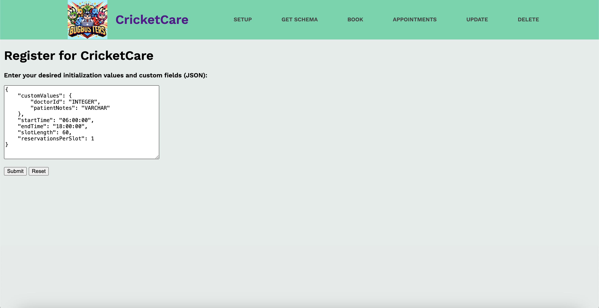
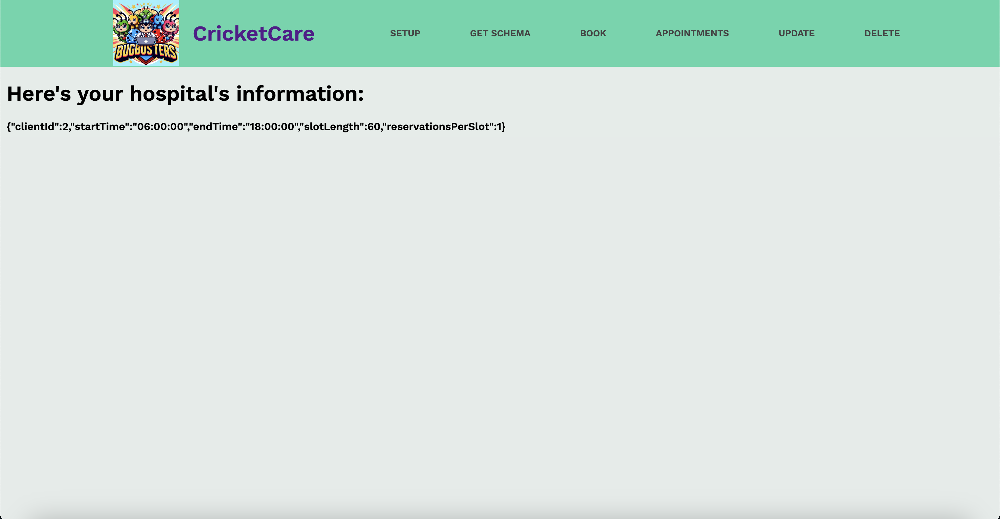
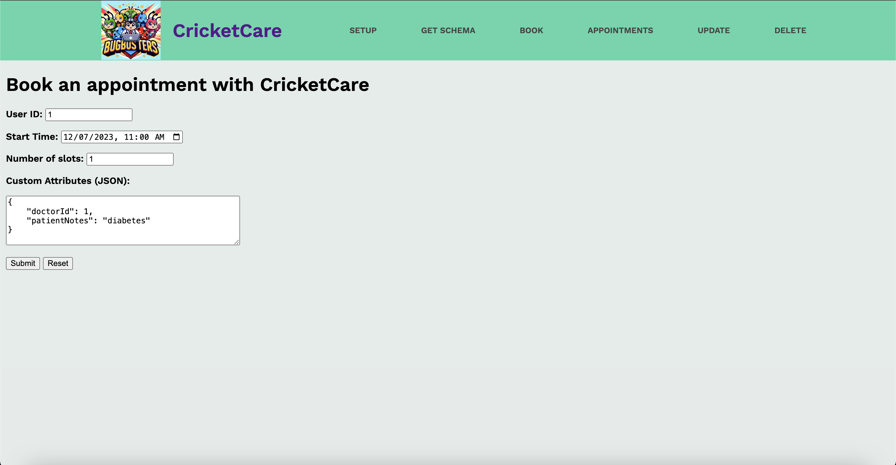
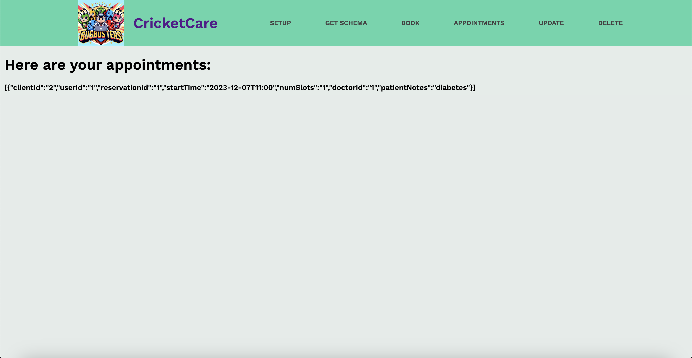
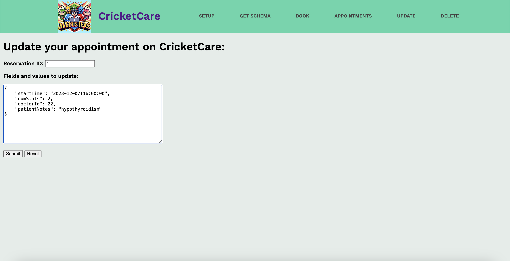
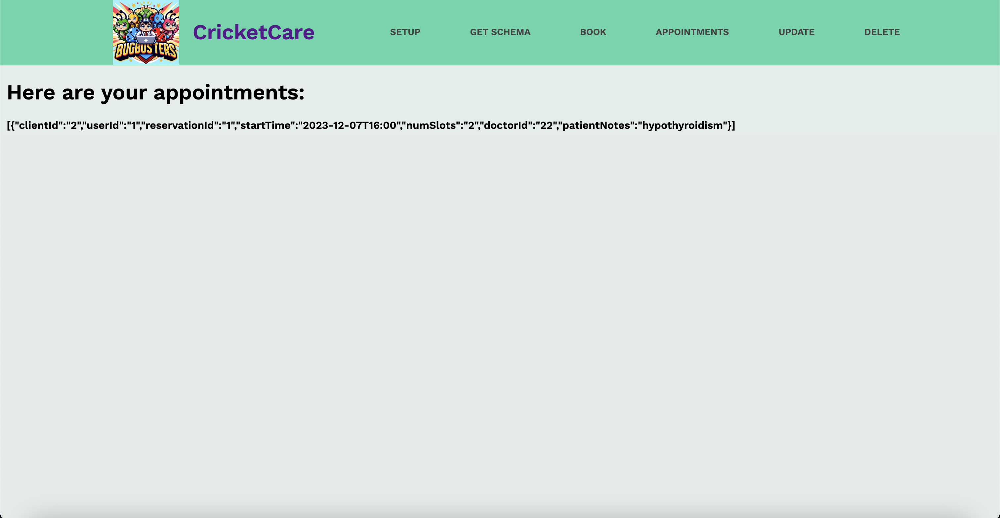
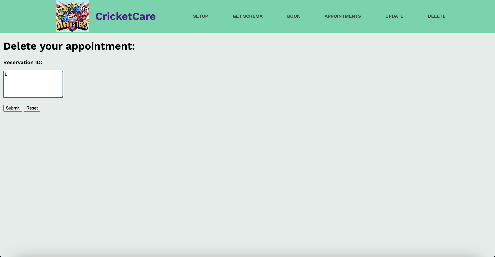
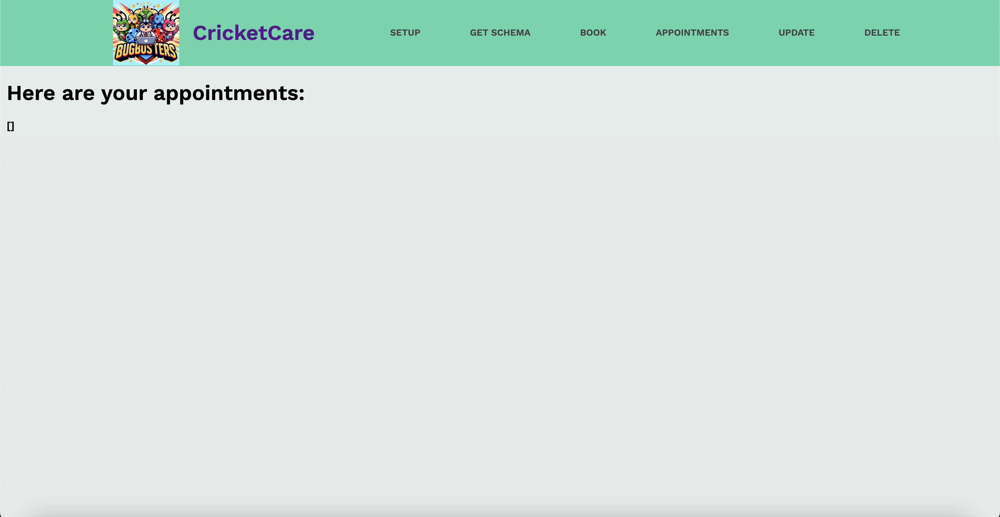

# CricketCare

a hospital client application, made with <3 by BugBusters.\
Peter Ma, Faustina Cheng, Shreya Somayajula, Youngseo Lee, & Patrick Tong

# Description

CricketCare is a hospital reservation application designed to streamline appointment booking processes for healthcare providers. This web application allows front desk clerks and healthcare professionals to efficiently manage appointments on behalf of their patients. After completing the onboarding and setup process, users, such as hospital front desk clerks, can leverage CricketCare to make bookings, check appointment availability, cancel appointments, and retrieve a patient's complete appointment history.

# Benefits of CricketCare:

**Streamlined Reservation Process:**

- Before: Healthcare providers might have relied on manual methods, phone calls, or paper-based systems for appointment scheduling, leading to inefficiencies and potential errors.
- After: CricketCare offers a web-based application that streamlines the reservation process. Front desk clerks and healthcare professionals can easily schedule appointments, check availability, and manage bookings with a few clicks, reducing manual workload and minimizing errors.

**Customized Reservation Fields:**

- Before: Traditional systems often provided fixed fields for appointment details, limiting the ability to capture specific information relevant to different medical specialties.
- After: CricketCare allows hospitals to define custom reservation schemas. This means healthcare providers can capture specialized information such as vaccination types, diagnosis details, dental procedures, and more. The system adapts to the unique needs of each hospital, providing a tailored approach to appointment management.

**Centralized Appointment Management:**

- Before: Managing appointments across different medical specialties might have involved using disparate systems or manual records, leading to fragmentation and potential communication gaps.
- After: CricketCare provides a centralized platform for managing appointments across diverse medical practices within a hospital. Front desk clerks can view, update, and retrieve comprehensive appointment details from a single application, improving overall coordination and reducing the likelihood of oversight.

**Efficient Backend Integration:**

- Before: Connecting with backend services for appointment management might have been complex, requiring extensive development efforts and custom integration solutions.
- After: CricketCare seamlessly integrates with the BugYourSpot backend service, leveraging API calls to modify and update appointment data associated with a particular hospital. This integration is designed for efficiency, enabling faster and more reliable communication between the client application and the backend service.

# Example Schemas for different CricketCare hospitals

The customizability of the CricketCare client application is enabled by the generality of the backend service itself. That is, different instances of CricketCare can act as completely independent clients, each with their own schema to describe what a "reservation" or "appointment" is. For example, a pediatric hospital may have the following custom fields inserted in their schema during onboarding:

```json
{
  ...

  "customValues": {
    "doctorId": "INTEGER",
    "patientId": "INTEGER",
    "patientNotes": "VARCHAR",
    "height": "DOUBLE",
    "weight": "DOUBLE"
  }
}
```

While a dental clinic may have the following schema instead:

```json
{
  ...

  "customValues": {
    "dentistId": "INTEGER",
    "anesthesiaRequired": "BOOLEAN",
    "procedureType": "VARCHAR"
  }
}
```

# Example Usage of BugYourSpot API

`POST api/v1/reservation/createClient`


`GET api/v1/reservation/getClient?clientId=1`


`POST api/v1/reservation`


`GET api/v1/reservation/getClientReservations?clientId=1`


`PUT api/v1/reservation`


`GET api/v1/reservation/getClientReservations?clientId=1`


`DELETE api/v1/reservation?reservationId=1`


`GET api/v1/reservation/getClientReservations?clientId=1`


# How to Setup

CricketCare interacts with the BugYourSpot backend service over the network, making API calls to perform various reservation-related tasks. The backend service provides a robust structure for handling reservations, allowing hospitals to define custom reservation schemas, and manage reservations effortlessly. These API calls are triggered in response to certain actions taken by a user of the client application.

To access the client application, these are the necessary steps. The assumption is that the backend server, BugYourSpot, is already running in the background locally OR since it is also deployed on Google App Engine (https://bugyourspot-407405.uc.r.appspot.com/api/v1/reservation) it can be accessed by anyone. However, for Google Cloud Credit purposes the service must be enabled/disabled by us manually.

1. Clone the Repository:

```
git clone https://github.com/your-username/CricketCare.git
cd CricketCare
```

2. Build and execute the application

```
./mvnw spring-boot:run
```

3. Access the initial page on the web application in browser

```
http://localhost:8080/setup
```

# How to Setup with Docker

1. Clone the Repository:

```
git clone https://github.com/your-username/CricketCare.git
cd CricketCare
```

2. Build using Docker

- Note: [Docker](https://docs.docker.com/get-docker/) should be installed on your machine.

```
docker build -t my-application:my-application .
docker run -d -p 8080:8080 --name myContainer my-application:my-application
```

3. Access the initial page on the web application in browser

```
http://localhost:8080/setup
```
